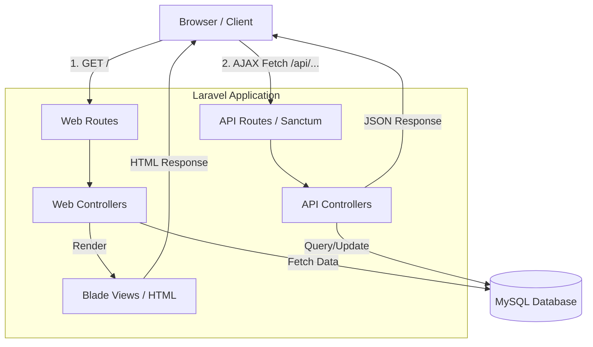
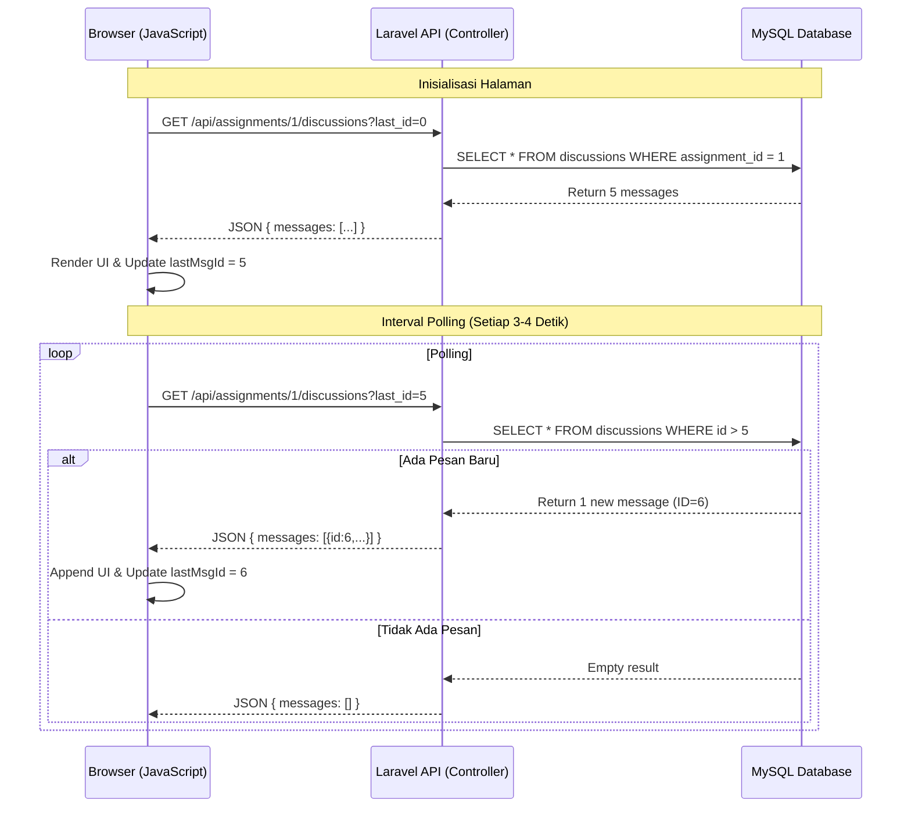

# Sistem Absensi dan Manajemen Tugas Real-Time 🎓

Sistem informasi akademik berbasis web yang dirancang untuk memfasilitasi absensi mahasiswa secara *real-time*, pengumpulan tugas, dan ruang diskusi *live* antara dosen dan mahasiswa. Dibangun dengan framework Laravel dengan pendekatan arsitektur hibrida (Blade Server-Side Rendering + Stateful API).

## 🚀 Fitur Utama
1. **Role-Based Access Control (RBAC)**: Tiga peran utama yaitu Admin, Dosen, dan Mahasiswa dengan hak akses yang tersolasi secara aman.
2. **Absensi Asinkronus (Real-Time)**: Mahasiswa dapat melakukan *check-in* absensi dan data akan otomatis tersinkronisasi ke *dashboard* Dosen secara *live* menggunakan AJAX polling.
3. **Manajemen Tugas & Ruang Diskusi Live**: Dosen dapat memantau status pengumpulan tugas secara *real-time*. Terdapat fitur *Live Chat Box* di setiap tugas yang memungkinkan diskusi interaktif layaknya grup *chat*.
4. **Server-Side Rendering (SSR) DataTables**: Optimalisasi *query database* (menghindari N+1 queries) menggunakan Yajra DataTables untuk *lazy-loading* dan paginasi tabel data bervolume besar.
5. **Keamanan Tambahan**: Proteksi *Missing Data* dengan SweetAlert, registrasi *custom* dengan kode rahasia, serta proteksi visibilitas password.

---

## 🏗️ Arsitektur Sistem (System Architecture)

Sistem ini menerapkan pola **Client-Server Architecture** dengan pemisahan jalur komunikasi untuk rendering UI dan pertukaran data *real-time*.



---

## 🛠️ Arsitektur Teknikal (Technical Architecture)

Secara teknis, aplikasi ini memadukan **Monolithic MVC** dengan **RESTful API** untuk menangani *payload* data asinkronus secara efisien.

1. **Frontend Layer**: Menggunakan **Blade Templating Engine**, **Bootstrap 5**, dan **Vanilla JavaScript** (Fetch API).
2. **Security Layer**: Menggunakan **Laravel Sanctum** (`EnsureFrontendRequestsAreStateful`) untuk memfasilitasi otentikasi *Cookie-based* pada rute `/api` sehingga *request* AJAX dari *frontend* tetap tersertifikasi tanpa perlu *Bearer Token* manual.
3. **Backend Layer**: **Laravel 10/11** mengelola logika bisnis di *Controllers*. Logika *real-time* dipusatkan pada `Api/AttendanceController`, `Api/AssignmentSubmissionController`, dan `Api/DiscussionController`.
4. **Database Layer**: **MySQL** dikelola sepenuhnya oleh Laravel Eloquent ORM.

---

## ⚙️ Algoritma & Alur Kerja Utama

### Algoritma Real-Time Polling (Long Polling Alternative)
Untuk mencapai efek *real-time* tanpa membebani server dengan WebSocket, sistem menggunakan algoritma *Short-Polling* berbasis kursor (`last_id`):



### Algoritma Role-Based Access Control (RBAC)
Sistem memvalidasi setiap *request* menggunakan *Middleware* kustom:
1. Pengguna melakukan *Login*.
2. *Session* diinisialisasi beserta atribut `role` (Admin/Dosen/Mahasiswa).
3. Saat *request* ke *Route* terproteksi (misal: `/dosen/dashboard`), `RoleMiddleware` membaca profil *User*.
4. Jika `role` tidak sesuai dengan rute yang diminta, lemparkan `HTTP 403 UNAUTHORIZED`.

## 🔑 Akun Pengujian Default (Default Test Accounts)

Untuk mempermudah pengujian seluruh fitur (Admin, Dosen, Mahasiswa), Anda dapat menggunakan akun bawaan berikut. Password default untuk seluruh akun adalah `password`.

### 1. Akun Administrator & Mahasiswa Demo
| Peran (Role) | Username / Email / NIM | Password | Keterangan |
| --- | --- | --- | --- |
| **Admin** | `admin@example.com` | `password` | Mengelola kelas, jadwal, prodi, dan data user |
| **Mahasiswa** | `20240010001` (NIM) | `password` | Mahasiswa prodi Teknik Informatika |
| **Mahasiswa** | `20240020001` (NIM) | `password` | Mahasiswa prodi Sistem Informasi |

### 2. Akun Dosen Pengajar Default
| Kode Dosen (NIP) | Nama Dosen | Program Studi (Prodi) | Email | Password |
| --- | --- | --- | --- | --- |
| `DSN001` | Eko Rahayu, M.T | Teknik Informatika | `dosen001@kampus.ac.id` | `password` |
| `DSN002` | Eko Wijaya, M.Kom | Teknik Informatika | `dosen002@kampus.ac.id` | `password` |
| `DSN003` | Lestari Susilo, Ph.D | Teknik Informatika | `dosen003@kampus.ac.id` | `password` |
| `DSN004` | Joko Susilo, M.Kom | Sistem Informasi | `dosen004@kampus.ac.id` | `password` |
| `DSN005` | Irfan Rahayu, M.Ak | Sistem Informasi | `dosen005@kampus.ac.id` | `password` |
| `DSN006` | Gunawan Rahayu, M.Pd | Sistem Informasi | `dosen006@kampus.ac.id` | `password` |
| `DSN007` | Eko Handayani, M.Ak | Teknik Mesin | `dosen007@kampus.ac.id` | `password` |
| `DSN008` | Fitri Utami, M.Si | Teknik Mesin | `dosen008@kampus.ac.id` | `password` |
| `DSN009` | Lestari Utami, M.T | Teknik Mesin | `dosen009@kampus.ac.id` | `password` |
| `DSN010` | Joko Lestari, M.Ak | Administrasi Bisnis | `dosen010@kampus.ac.id` | `password` |
| `DSN011` | Joko Hadi, M.Si | Administrasi Bisnis | `dosen011@kampus.ac.id` | `password` |
| `DSN012` | Nanda Susilo, Ph.D | Administrasi Bisnis | `dosen012@kampus.ac.id` | `password` |
| `DSN013` | Kartika Handayani, M.Pd | Akuntansi | `dosen013@kampus.ac.id` | `password` |
| `DSN014` | Eko Prasetyo, M.Kom | Akuntansi | `dosen014@kampus.ac.id` | `password` |
| `DSN015` | Siti Permana, M.Kom | Akuntansi | `dosen015@kampus.ac.id` | `password` |

---

## 💻 Instalasi dan Konfigurasi

1. **Clone repositori ini**:
   ```bash
   git clone https://github.com/not162/project-absensi-mahasiswa.git
   cd project-absensi-mahasiswa
   ```
2. **Install dependensi PHP dan Node**:
   ```bash
   composer install
   npm install && npm run build
   ```
3. **Konfigurasi Environment**:
   Salin `.env.example` ke `.env` dan atur koneksi database Anda.
   ```bash
   cp .env.example .env
   php artisan key:generate
   ```
4. **Migrasi Database**:
   ```bash
   php artisan migrate --seed
   ```
5. **Jalankan Aplikasi**:
   ```bash
   php artisan serve
   ```
