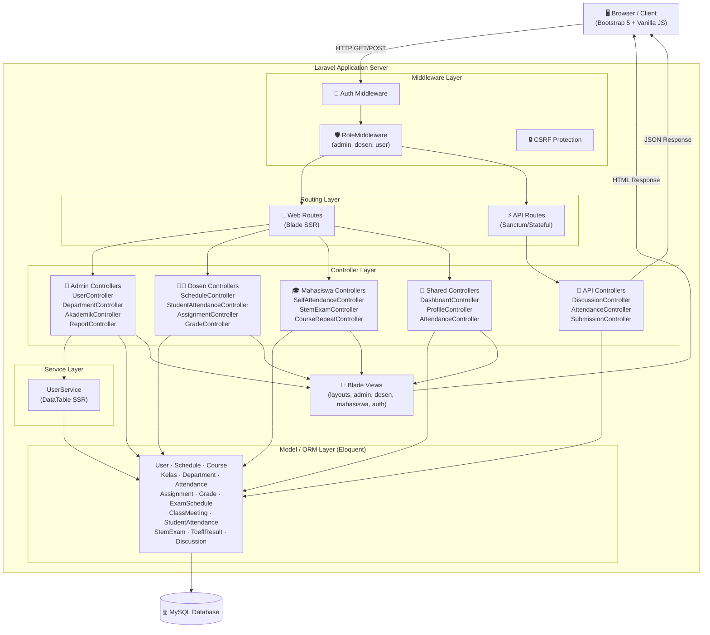
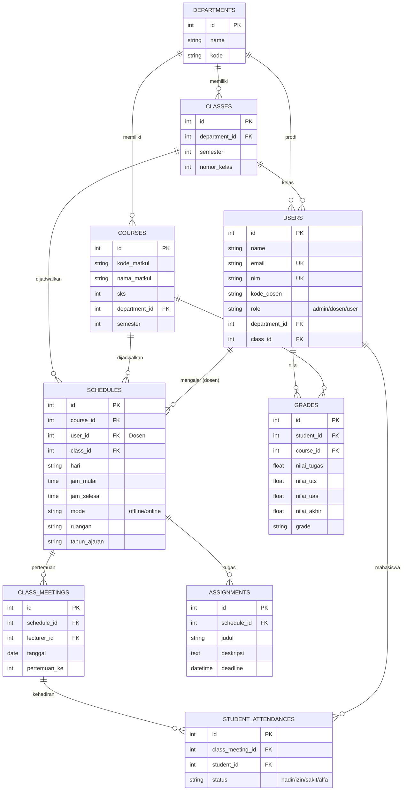
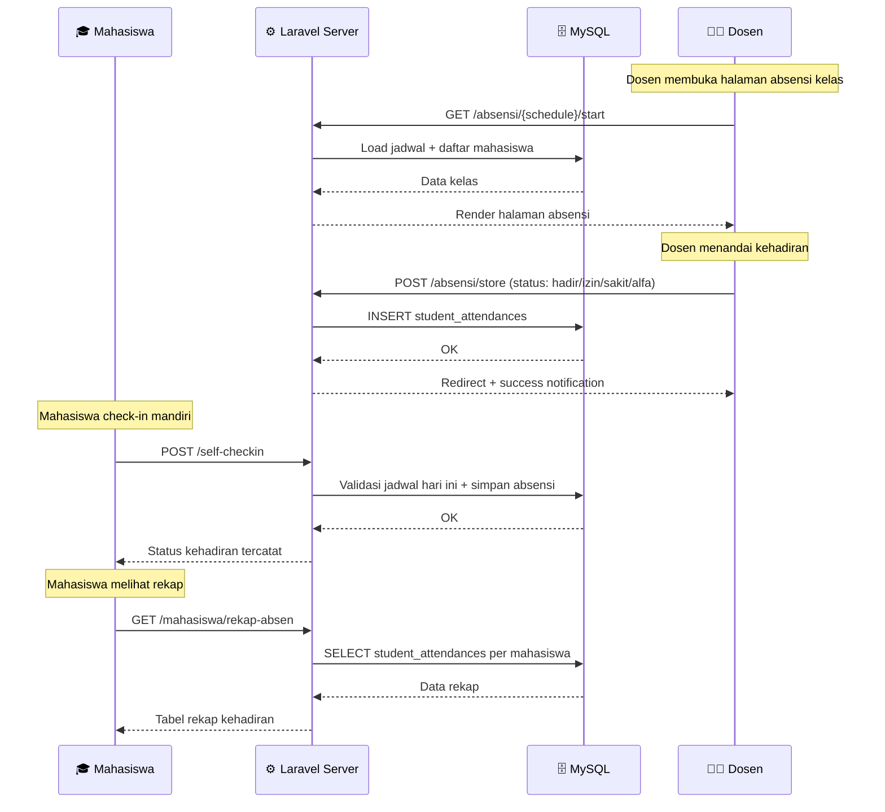
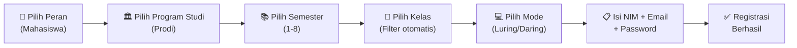
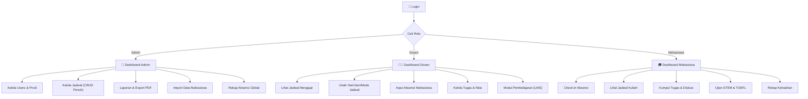
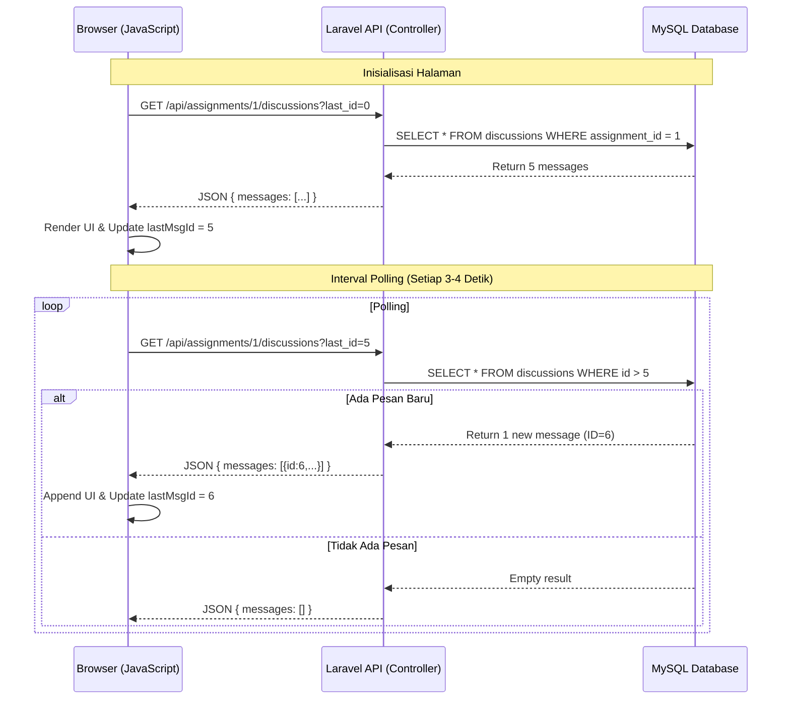

# Sistem Absensi & Manajemen Akademik Real-Time 🎓

Sistem informasi akademik berbasis web full-stack yang dirancang untuk memfasilitasi absensi mahasiswa secara *real-time*, manajemen jadwal perkuliahan, pengumpulan tugas, ujian STEM/TOEFL, dan ruang diskusi *live* antara dosen dan mahasiswa. Dibangun dengan **Laravel 10** menggunakan pendekatan arsitektur hibrida (Blade SSR + Stateful RESTful API).

> **Universitas Pamulang**
> Jl. Suryakencana No.1, Pamulang Bar., Kec. Pamulang, Kota Tangerang Selatan, Banten 15417

---

## 🚀 Fitur Utama

| # | Fitur | Deskripsi |
|---|-------|-----------|
| 1 | **Role-Based Access Control (RBAC)** | Tiga peran utama (Admin, Dosen, Mahasiswa) dengan hak akses tersolasi menggunakan custom `RoleMiddleware` |
| 2 | **Absensi Real-Time** | Mahasiswa check-in manual, data tersinkronisasi ke dashboard Dosen secara live via AJAX polling |
| 3 | **Manajemen Jadwal Perkuliahan** | Admin membuat jadwal, Dosen dapat mengubah hari/jam/mode/ruangan jadwal miliknya sendiri |
| 4 | **Manajemen Tugas & Diskusi Live** | Dosen memantau pengumpulan tugas real-time, Live Chat Box di setiap tugas |
| 5 | **Ujian STEM & TOEFL** | Modul ujian online untuk evaluasi kemampuan mahasiswa |
| 6 | **Registrasi Cascading** | Registrasi mahasiswa dengan alur: Prodi → Semester (1-8) → Kelas → Mode Luring/Daring |
| 7 | **SSR DataTables** | Optimasi query (N+1 prevention) via Yajra DataTables dengan filter Prodi & Semester |
| 8 | **Rekap Absensi** | Rekapitulasi kehadiran per mahasiswa, per kelas, dan per mata kuliah |
| 9 | **LMS Modul Pembelajaran** | Dosen dapat mengelola modul pembelajaran digital |
| 10 | **Export PDF & Import Excel** | Data mahasiswa dapat di-export ke PDF dan di-import dari CSV/Excel |
| 11 | **Pengajuan Izin & Sakit (Upload Bukti)** | Mahasiswa mengunggah surat keterangan/bukti saat izin/sakit untuk ditinjau oleh Dosen |
| 12 | **Early Warning System Kehadiran** | Alert otomatis jika tingkat kehadiran mahasiswa/rata-rata kelas di bawah 75% |
| 13 | **Dashboard Analytics (Chart.js)** | Visualisasi grafik doughnut interaktif mengenai komposisi kehadiran di Dashboard Dosen |
| 14 | **Cetak KHS PDF** | Ekspor Kartu Hasil Studi (KHS) resmi berformat PDF dengan kop surat universitas |
| 15 | **CRUD Foto Profil Peran** | Manajemen (upload, preview, delete) foto profil secara andal untuk Admin, Dosen, dan Mahasiswa |
| 16 | **Pencarian Semantik Matakuliah (RAG & AI)** | Pencarian mata kuliah menggunakan pemanggilan API Groq Llama-3.3 secara semantik (dengan fallback lokal TF-IDF Cosine Similarity) dan rekomendasi mata kuliah pintar berbasis prodi/semester mahasiswa |
| 17 | **MyUniv AI Advisor (Chatbot Akademik)** | Chatbot bimbingan akademik terintegrasi RAG data nilai, jadwal, dan kehadiran real-time mahasiswa dengan guardrails anti-halusinasi dan real-time timestamping |
| 18 | **STARS Algorithm & Decision Engine** | Sistem penilaian 1-5 bintang serta keputusan sistem rekomendasi bimbingan akademik langsung berdasarkan keaktifan absensi, tugas, dan nilai mahasiswa |
| 19 | **Heatmap Kehadiran & AI Context Trainer** | Dosen dapat melatih/mengarahkan asisten AI mahasiswa via form Context Trainer serta memantau keaktifan kelas secara visual dengan gradasi warna di 16 pertemuan |

---

## 🏗️ Arsitektur Sistem (System Architecture)

Sistem ini menerapkan pola **Client-Server Architecture** dengan pemisahan jalur komunikasi untuk rendering UI dan pertukaran data *real-time*.



---

## 📊 Entity Relationship Diagram (ERD)



---

## 🔄 Alur Kerja Utama (Flow Diagrams)

### Alur Absensi Real-Time



### Alur Registrasi Cascading Mahasiswa Baru



### Alur Role-Based Access Control (RBAC)



---

## ⚙️ Algoritma & Teknologi

### Algoritma Real-Time Polling (Short-Polling)



### Tech Stack

| Layer | Teknologi |
|-------|-----------|
| **Frontend** | Blade Templating, Bootstrap 5, Vanilla JavaScript (Fetch API), SweetAlert2 |
| **Backend** | Laravel 10, PHP 8.4 |
| **Auth & Security** | Laravel Sanctum (Cookie-based), CSRF Token, Custom RoleMiddleware |
| **Database** | MySQL, Eloquent ORM, Yajra DataTables (SSR) |
| **Tooling** | Composer, NPM, Artisan CLI, Laragon |

---

## 🔑 Akun Pengujian Default (Default Test Accounts)

Untuk mempermudah pengujian seluruh fitur, Anda dapat menggunakan akun bawaan berikut setelah menjalankan `php artisan migrate --seed`. Password default untuk seluruh akun adalah `password`.

### 1. Akun Administrator & Mahasiswa Demo
| Peran (Role) | Username / Email / NIM | Password | Keterangan |
| --- | --- | --- | --- |
| **Admin** | `admin@example.com` | `password` | Mengelola kelas, jadwal, prodi, dan data user |
| **Mahasiswa** | `20240010001` (NIM) | `password` | Mahasiswa prodi Teknik Informatika |
| **Mahasiswa** | `20240020001` (NIM) | `password` | Mahasiswa prodi Sistem Informasi |

### 2. Akun Dosen Pengajar Default
| Kode Dosen (NIP) | Nama Dosen | Program Studi (Prodi) | Email | Password |
| --- | --- | --- | --- | --- |
| `DSN001` | Eko Rahayu, M.T | Teknik Informatika | `dosen001@kampus.ac.id` | `password` |
| `DSN002` | Eko Wijaya, M.Kom | Teknik Informatika | `dosen002@kampus.ac.id` | `password` |
| `DSN003` | Lestari Susilo, Ph.D | Teknik Informatika | `dosen003@kampus.ac.id` | `password` |
| `DSN004` | Joko Susilo, M.Kom | Sistem Informasi | `dosen004@kampus.ac.id` | `password` |
| `DSN005` | Irfan Rahayu, M.Ak | Sistem Informasi | `dosen005@kampus.ac.id` | `password` |
| `DSN006` | Gunawan Rahayu, M.Pd | Sistem Informasi | `dosen006@kampus.ac.id` | `password` |
| `DSN007` | Eko Handayani, M.Ak | Teknik Mesin | `dosen007@kampus.ac.id` | `password` |
| `DSN008` | Fitri Utami, M.Si | Teknik Mesin | `dosen008@kampus.ac.id` | `password` |
| `DSN009` | Lestari Utami, M.T | Teknik Mesin | `dosen009@kampus.ac.id` | `password` |
| `DSN010` | Joko Lestari, M.Ak | Administrasi Bisnis | `dosen010@kampus.ac.id` | `password` |
| `DSN011` | Joko Hadi, M.Si | Administrasi Bisnis | `dosen011@kampus.ac.id` | `password` |
| `DSN012` | Nanda Susilo, Ph.D | Administrasi Bisnis | `dosen012@kampus.ac.id` | `password` |
| `DSN013` | Kartika Handayani, M.Pd | Akuntansi | `dosen013@kampus.ac.id` | `password` |
| `DSN014` | Eko Prasetyo, M.Kom | Akuntansi | `dosen014@kampus.ac.id` | `password` |
| `DSN015` | Siti Permana, M.Kom | Akuntansi | `dosen015@kampus.ac.id` | `password` |

---

## 💻 Instalasi & Konfigurasi (Step by Step)

### Prasyarat (Prerequisites)

Pastikan Anda memiliki perangkat lunak berikut yang sudah terpasang di komputer:

| Software | Versi Minimum | Download |
|----------|---------------|----------|
| **PHP** | 8.1+ | [php.net](https://www.php.net/downloads) |
| **Composer** | 2.x | [getcomposer.org](https://getcomposer.org/download/) |
| **MySQL** | 5.7+ / MariaDB 10.4+ | [mysql.com](https://dev.mysql.com/downloads/) |
| **Node.js** | 16+ | [nodejs.org](https://nodejs.org/) |
| **Git** | 2.x | [git-scm.com](https://git-scm.com/) |

> **💡 Tips:** Gunakan [Laragon](https://laragon.org/) (Windows) atau [XAMPP](https://www.apachefriends.org/) untuk mendapatkan PHP + MySQL sekaligus secara praktis.

### Step 1: Clone Repositori

```bash
git clone https://github.com/not162/project-absensi-mahasiswa.git
cd project-absensi-mahasiswa
```

### Step 2: Install Dependensi PHP (Composer)

```bash
composer install
```

> Perintah ini akan mengunduh seluruh package PHP yang dibutuhkan (Laravel, Yajra DataTables, dll).

### Step 3: Install Dependensi Frontend (NPM)

```bash
npm install
npm run build
```

> Perintah ini mengunduh Bootstrap, SweetAlert2, dan library frontend lainnya, lalu mem-compile aset.

### Step 4: Konfigurasi Environment (.env)

```bash
cp .env.example .env
```

Buka file `.env` dan sesuaikan konfigurasi database Anda:

```env
DB_CONNECTION=mysql
DB_HOST=127.0.0.1
DB_PORT=3306
DB_DATABASE=project_absensi
DB_USERNAME=root
DB_PASSWORD=
```

> **Catatan:** Jika menggunakan Laragon, username default adalah `root` tanpa password.

### Step 5: Generate Application Key

```bash
php artisan key:generate
```

### Step 6: Buat Database

Buat database baru di MySQL dengan nama sesuai `DB_DATABASE` di file `.env`:

```sql
CREATE DATABASE project_absensi;
```

Atau via terminal:
```bash
mysql -u root -e "CREATE DATABASE project_absensi"
```

### Step 7: Jalankan Migrasi & Seeder

```bash
php artisan migrate --seed
```

> Perintah ini akan:
> - Membuat seluruh tabel di database (migrasi)
> - Mengisi data awal: Prodi, Kelas, Mata Kuliah, Akun Admin, 15 Akun Dosen, Jadwal, dan Soal STEM (`--seed`)

### Step 8: Buat Symbolic Link untuk Storage (Opsional)

```bash
php artisan storage:link
```

> Diperlukan jika ada fitur upload file (tugas, modul pembelajaran).

### Step 9: Jalankan Aplikasi

```bash
php artisan serve
```

Buka browser Anda dan akses:

```
http://127.0.0.1:8000
```

### Step 10: Login dan Mulai Gunakan

1. **Sebagai Admin:** Login dengan `admin@example.com` / `password`
2. **Sebagai Dosen:** Login dengan salah satu email dosen (lihat tabel di atas)
3. **Sebagai Mahasiswa:** Registrasi akun baru atau login dengan NIM `20240010001` / `password`

---

## 📁 Struktur Direktori Project

```
project-absensi-mahasiswa/
├── app/
│   ├── Http/
│   │   ├── Controllers/         # 22 Controllers (Admin, Dosen, Mahasiswa, API)
│   │   │   ├── Admin/           # StudentVerificationController
│   │   │   ├── Api/             # DiscussionController, AttendanceController, SubmissionController
│   │   │   └── Auth/            # AuthController (Login, Register)
│   │   └── Middleware/
│   │       └── RoleMiddleware.php   # Custom RBAC middleware
│   ├── Models/                  # 23 Eloquent Models
│   └── Services/
│       └── UserService.php      # DataTable SSR (N+1 query optimization)
├── database/
│   ├── migrations/              # Skema seluruh tabel
│   └── seeders/
│       ├── DatabaseSeeder.php   # Seeder utama (Prodi, Kelas, Matkul, Jadwal, User)
│       ├── DosenSeeder.php      # 15 akun dosen default
│       ├── SaturdayScheduleSeeder.php
│       └── StemSeeder.php       # Soal ujian STEM
├── resources/views/
│   ├── layouts/                 # Master layout + Navbar
│   ├── admin/jadwal/            # CRUD Jadwal (index, create, edit, by_dosen)
│   ├── auth/                    # Login & Register (cascading form)
│   ├── dosen/                   # Views khusus dosen
│   └── users/                   # Data Mahasiswa (DataTable + filter)
├── routes/
│   └── web.php                  # 80+ routes (Admin, Dosen, Mahasiswa, Mixed)
├── .env.example                 # Template konfigurasi environment
├── composer.json                # Dependensi PHP
└── package.json                 # Dependensi Frontend
```

---

## 🛡️ Keamanan (Security)

| Fitur Keamanan | Implementasi |
|----------------|-------------|
| **Authentication** | Laravel built-in Auth + Bcrypt password hashing |
| **Authorization** | Custom `RoleMiddleware` untuk proteksi route per-role |
| **CSRF Protection** | Token CSRF otomatis di setiap form POST/PUT/DELETE |
| **API Authentication** | Laravel Sanctum (Cookie-based stateful auth) |
| **Input Validation** | Server-side validation di setiap Controller |
| **SQL Injection Prevention** | Eloquent ORM parameterized queries |
| **XSS Prevention** | Blade auto-escaping (`{{ }}`) |
| **Mass Assignment Protection** | `$fillable` whitelist di setiap Model |

---

## 📄 Lisensi

Project ini dibuat untuk keperluan akademik di **Universitas Pamulang**.

---

<p align="center">
  <b>Dibuat dengan Ridwan & dkk. menggunakan Laravel</b><br>
  <sub>Sistem Absensi & Manajemen Akademik Real-Time</sub>
</p>
